# Sushi Ordering Process - Diagrams

This document contains BPMN and sequence diagrams that visualize the complete ordering process for the Puzati Sushi Brovary website.

## Table of Contents
- [BPMN Diagram - Overall Process](#bpmn-diagram---overall-process)
- [Sequence Diagram - User Interactions](#sequence-diagram---user-interactions)
- [Sequence Diagram - Order Submission](#sequence-diagram---order-submission)

---

## BPMN Diagram - Overall Process

This BPMN 2.0 diagram shows the complete business process flow from browsing to order completion, following the standard notation from [BPMN.org](https://www.bpmn.org/).

**Legend:**
- ○ Start/End Events (circles)
- ▢ Tasks/Activities (rounded rectangles)
- ◇ Gateways (diamonds for decisions/splits/merges)
- → Sequence Flows (arrows)

---

## Sequence Diagram - User Interactions

This sequence diagram shows the interaction between the user, UI components, and state management during the ordering process.

```mermaid
sequenceDiagram
    actor User
    participant Hero
    participant Header
    participant Menu
    participant MenuItem
    participant Cart
    participant OrderForm
    participant State as React State
    participant Toast
    
    User->>Hero: Lands on website
    Hero->>User: Display hero section
    User->>Hero: Click "Замовити" button
    Hero->>Menu: Scroll to menu section
    
    User->>Menu: Browse menu items
    User->>Menu: Select category (optional)
    Menu->>MenuItem: Filter and display items
    
    User->>MenuItem: Click "Додати" button
    MenuItem->>State: addToCart(item)
    
    alt Item exists in cart
        State->>State: Increment quantity
    else New item
        State->>State: Add item with quantity 1
    end
    
    State->>Toast: Show success notification
    Toast->>User: "Додано до кошика"
    State->>Header: Update cart count
    
    loop User adds more items
        User->>MenuItem: Click "Додати" on other items
        MenuItem->>State: addToCart(item)
        State->>Toast: Show notification
        State->>Header: Update cart count
    end
    
    User->>Header: Click cart icon
    Header->>Cart: Open cart sheet
    Cart->>User: Display cart items & total
    
    alt User modifies cart
        User->>Cart: Click +/- or trash icon
        Cart->>State: updateQuantity(id, change) or removeFromCart(id)
        State->>Cart: Update cart display
    end
    
    User->>Cart: Click "Оформити замовлення"
    Cart->>State: handleCheckout()
    State->>Cart: Close cart
    State->>OrderForm: Open order form
    
    OrderForm->>User: Display form fields & total
```

---

## Sequence Diagram - Order Submission

This sequence diagram details the order submission process, including form validation and API communication.

```mermaid
sequenceDiagram
    actor User
    participant OrderForm
    participant FormState as Form State
    participant Validation
    participant API as Google Forms API
    participant Toast
    participant AppState as App State
    
    User->>OrderForm: Fill name field
    OrderForm->>FormState: Update name
    User->>OrderForm: Fill phone field
    OrderForm->>FormState: Update phone
    User->>OrderForm: Fill address field
    OrderForm->>FormState: Update address
    
    opt Add optional comment
        User->>OrderForm: Fill comment field
        OrderForm->>FormState: Update comment
    end
    
    OrderForm->>User: Display order total
    User->>OrderForm: Click "Підтвердити замовлення"
    
    OrderForm->>Validation: Validate required fields
    
    alt Validation fails
        Validation->>OrderForm: Return validation errors
        OrderForm->>User: Show required field errors
    else Validation passes
        Validation->>OrderForm: Validation successful
        OrderForm->>OrderForm: Set isSubmitting = true
        OrderForm->>User: Show "Відправка..." button
        
        OrderForm->>OrderForm: Format order details
        Note over OrderForm: Create line items:<br/>Item x Qty - Price UAH
        
        OrderForm->>OrderForm: Prepare form data
        Note over OrderForm: Map to Google Forms fields:<br/>- entry.226695464: name<br/>- entry.410185675: phone<br/>- entry.700388645: address<br/>- entry.1382095200: order details<br/>- entry.557539628: comment<br/>- entry.597298013: total
        
        OrderForm->>API: POST with URLSearchParams
        Note over OrderForm,API: mode: 'no-cors'<br/>Content-Type: application/x-www-form-urlencoded
        
        alt API call fails
            API-->>OrderForm: Error response
            OrderForm->>Toast: Show error toast
            Toast->>User: "Помилка: Не вдалося надіслати"
            OrderForm->>OrderForm: Set isSubmitting = false
        else API call succeeds
            API-->>OrderForm: Success (no-cors: opaque response)
            OrderForm->>Toast: Show success toast
            Toast->>User: "Замовлення прийнято! 🎉"
            OrderForm->>AppState: onOrderComplete()
            AppState->>AppState: Clear cart items
            OrderForm->>FormState: Clear all form fields
            OrderForm->>OrderForm: Set isSubmitting = false
            OrderForm->>OrderForm: Close dialog
        end
    end
```

---

## Process Description

### Key Components

1. **Header**: Contains the cart icon with item count badge
2. **Hero**: Landing section with call-to-action button
3. **Menu**: Displays menu items with category filters
4. **MenuItem**: Individual menu item card with "Add" button
5. **Cart**: Side sheet showing selected items with quantity controls
6. **OrderForm**: Modal dialog for customer information and order submission

### State Management

The application uses React hooks (`useState`) to manage:
- **cartItems**: Array of items with quantities
- **isCartOpen**: Boolean for cart visibility
- **isOrderFormOpen**: Boolean for order form visibility
- **formData**: Object containing customer information

### Data Flow

1. **Adding to Cart**: Items are added with quantity tracking; existing items have their quantity incremented
2. **Cart Operations**: Users can increase/decrease quantities or remove items entirely
3. **Order Submission**: Form data is sent to Google Forms via a POST request with `no-cors` mode
4. **Success Handling**: Upon successful submission, the cart is cleared and a confirmation toast is shown

### Integration Points

- **Google Forms API**: Order data is submitted to a Google Form endpoint (`entry.*` fields map to form questions)
- **Toast Notifications**: User feedback for add-to-cart, order success, and error states
- **Local State**: All cart and order data is managed client-side (no backend database)

---

## Technical Notes

### Google Forms Integration

The order form uses a Google Forms backend with the following field mappings:
- `entry.226695464` → Customer name
- `entry.410185675` → Phone number
- `entry.700388645` → Delivery address
- `entry.1382095200` → Order details (formatted list)
- `entry.557539628` → Customer comment
- `entry.597298013` → Order total

The form submission uses `mode: 'no-cors'` which means the application cannot read the response, but treats any non-error as success.

### User Experience Features

- **Toast Notifications**: Immediate feedback for all actions
- **Optimistic Updates**: UI updates before API confirmation
- **Form Validation**: Required fields enforced at browser level
- **Quantity Management**: Inline controls in cart for easy modifications
- **Responsive Design**: Works across mobile and desktop devices

---

## BPMN 2.0 XML File for Camunda Modeler

In addition to the Mermaid diagrams above, a standards-compliant **BPMN 2.0 XML file** is available for visualization in Camunda Modeler or other BPMN modeling tools.

**File**: [`ordering-process.bpmn`](ordering-process.bpmn)

### How to Use with Camunda Modeler

1. Download and install [Camunda Modeler](https://camunda.com/download/modeler/) (free, open-source)
2. Open Camunda Modeler
3. Click **File** → **Open File**
4. Select the `ordering-process.bpmn` file
5. The complete BPMN 2.0 diagram will be displayed with proper layout and styling
6. You can edit, export, or save the diagram as needed

### BPMN 2.0 Standard Compliance

The XML file follows the [BPMN 2.0 specification](https://www.bpmn.org/) from the Object Management Group (OMG), including:

- **Standard Elements**: Start/End events, tasks, exclusive gateways, sequence flows
- **Process Semantics**: Proper flow control with condition expressions
- **Visual Layout**: BPMNDiagram section with coordinates and waypoints
- **Namespaces**: Correct XML namespaces (bpmn, bpmndi, dc, di)

The file is compatible with:
- Camunda Modeler (recommended)
- Signavio
- Other BPMN 2.0 compliant tools

---

*Last Updated: November 29, 2025*

